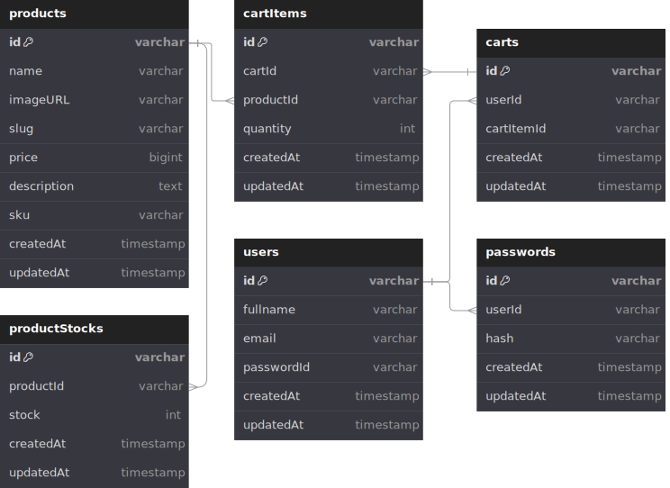

# Trikot (Backend)

Trikot Jersey Backend

## REST API Specification

- Production: `https://api.trikot.ridoatmanto.com`
- Local: `http://localhost:3000`

### Books API

| Endpoint            | HTTP     | Description                  |
| ------------------- | -------- | ---------------------------- |
| `/products`         | `GET`    | Get all product              |
| `/products/:id`     | `GET`    | Get products by id           |
| `/carts`            | `POST`   | Add cart                     |
| `/carts/:productId` | `DELETE` | Delete product from cart     |
| `/carts`            | `DELETE` | Delete All product from cart |
| `/auth/login`       | `POST`   | Login user                   |
| `/auth/me`          | `GET`    | Get user                     |
| `/auth/logout`      | `GET`    | Logout user                  |

## ERD



## Tech Stack

- Hono
- Bun
- TypeScript
- Docker
- PostgreSQL
- Prisma
- Render
- Neon.tech
- CloudFlare
- VSCode

## How to run this project (with `bun`)

To install dependencies:

```sh
bun install
```

To run App:

- Start project `bun dev`. Then open `http://localhost:3000`
- Create migration from existing schema `bun db:migrate:dev`.
- Applying migration just created `bun db:migrate:deploy`.
- Generate prisma client needed with `bun db:generate`.
- Running migration to init table `bun db:seed`.

## Runing App With Dockerfile

Build image for whole backend API

```sh
docker build -t demo-backend .
```

Run `docker-compose.yml` with:

```sh
docker compose up -d
```

## Sample JSON output preview:

### Product List

```json
[
  {
    "id": "1",
    "name": "BORUSSIA DORTMUND HOME JERSEY 2024-2025",
    "imageURL": "https://trikot.ridoatmanto.com/product-images/dortmund-jersey-home-2024-2025.png",
    "slug": "dortmund-jersey-home-2024-2025",
    "price": "157000",
    "description": "<ul><li>From kit supplier PUMA.</li><li>Puma cat and BVB emblem on the chest.</li><li>100% polyester 95 % recycled polyester thanks to Puma's RE:FIBRE process.</li><li>Flocked jerseys are delivered with GLS logo.</li></ul>",
    "sku": "JS-ALS-P245",
    "createdAt": "2024-07-27T15:20:07.458Z",
    "updatedAt": "2024-07-27T15:20:07.458Z"
  },
  {
    "id": "2",
    "name": "BORUSSIA DORTMUND HOME JERSEY 2023-2024",
    "imageURL": "https://trikot.ridoatmanto.com/product-images/dortmund-jersey-home-2023-2024.png",
    "slug": "dortmund-jersey-home-2023-2024",
    "price": "150000",
    "description": "<ul><li>From kit supplier PUMA.</li><li>Puma cat and BVB emblem on the chest.</li><li>100% polyester 95 % recycled polyester thanks to Puma's RE:FIBRE process.</li><li>Flocked jerseys are delivered with GLS logo.</li></ul>",
    "sku": "HJ-ALS-P234",
    "createdAt": "2024-07-27T15:20:07.458Z",
    "updatedAt": "2024-07-27T15:20:07.458Z"
  }
]
```

## Futhermore Information

Another detail or something to discuss please contact me on Telegram on [t.me/ridoatmanto](https://t.me/ridoatmanto).

---

Created © 2024 by [Rido Atmanto](https://ridoatmanto.com)
